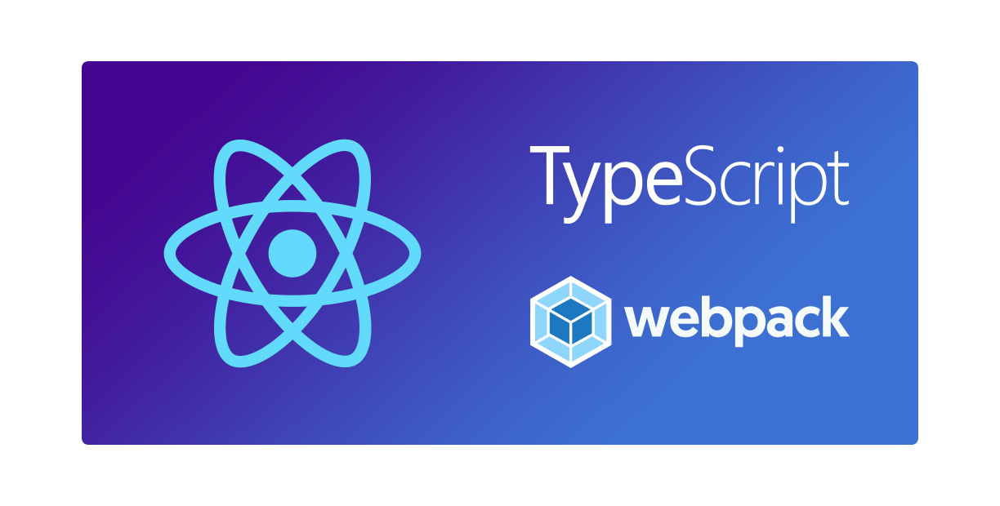
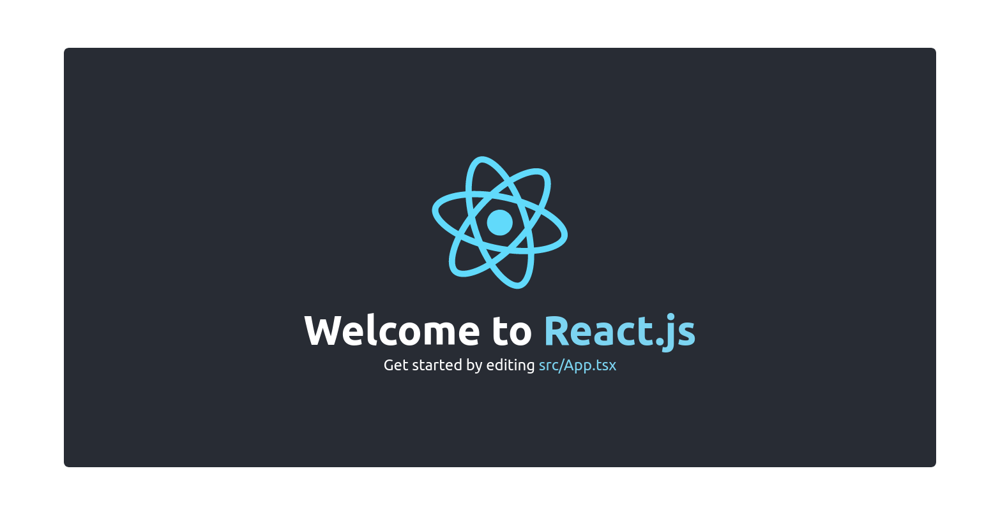

# Webpack Setup for React.js

Mininal Webpack and React.js Starter boilerplate.

## Motivation for this boilerplate

- The alternative for CRA is to set up your own boilerplate;
- We can eliminate all of its disadvantages by setting up dependencies and configs by ourselves (you can add dependencies as per your requirement) and easier to add/modify build configs;
- Minimal webpack and babel configs required to run a react application;
- Production-ready build set up, with linters and pre-commit hooks.
- Support for both JSX and TSX;
- A great option for React.js applications;

## Why?

I use React.js for almost every front-end project I create. Here's a boilerplate repo that I have been reusing for these projects.

Try it out for your next project or share what your structure looks like.

## Demo

<a href="https://fariasmateuss.github.io/webpack-setup-for-react/" rel="Lint to demo"></a>

## Usage

Create a new application using `create-react-app` with the `-e | --example` flag pointing to this repository's url, like so:

```bash
npx create-react-app project-name -e https://github.com/fariasmateuss/webpack-setup-for-react.git
```

## Run Locally

Step 1: Clone the project

```bash
git clone https://github.com/fariasmateuss/webpack-setup-for-react.git
```

Step 2: Go to the project directory

```bash
cd webpack-setup-for-react
```

Step 3: Install dependencies

```
yarn
```

Step 4: Start the server

```
yarn dev
```

Step 5: All Done

Once the build completes, your app is live! Open http://localhost:3000 with your browser to see the result.

Changes to components should hot-reload in the browser.

## Deployment

To deploy run the following command:

```bash
yarn build
```

The build will be placed in the `build` directory.

If you want to deploy to a different directory, you can specify the directory changing the path in the webpack config.

## Importing with Absolute Paths

When you import a file, you can either use a relative or absolute path.

```typescript
import { PayPalClient } from '../../services/PayPal';
```

Previous example can be rewritten to.

```typescript
import { PayPalClient } from '@services/PayPal';
```

In this example everything that starts with `@` will be loaded from `src/`. I like to call it `@` as it becomes easy to know whenever you’re importing something from your app rather than a NPM module.

## Scripts

- Start dev server using `yarn dev`.
- Build and bundling your resources for production `yarn build`.
- Deploy it to GitHub pages using `yarn deploy`
- `yarn type-check` validate code using TypeScript compiler.
- `yarn lint` and `yarn format` to run ESLint and Prettier for all files in the `src` directory.
- `yarn commit` run commitizen. Alternative to `git commit`.

## Switch to npm

By default, this boilerplate uses Yarn 1 (Classic), but this choice is yours. If you'd like to switch to npm, delete the `yarn.lock` file, install the dependencies with `npm install`, and change the CI workflows, Husky Git hooks, and lint-staged steps to use npm commands.

## Feedback

If you have any ideas or feedback for this project, please let me know. Connect with me on [Twitter](https://twitter.com/fariasmateuss) or [LinkedIn](https://www.linkedin.com/in/fariasmateuss/).

## Contributing

If you found this useful, please help us improve it by contributing.

## License

[MIT](https://github.com/fariasmateuss/webpack-setup-for-react/blob/master/LICENSE)
